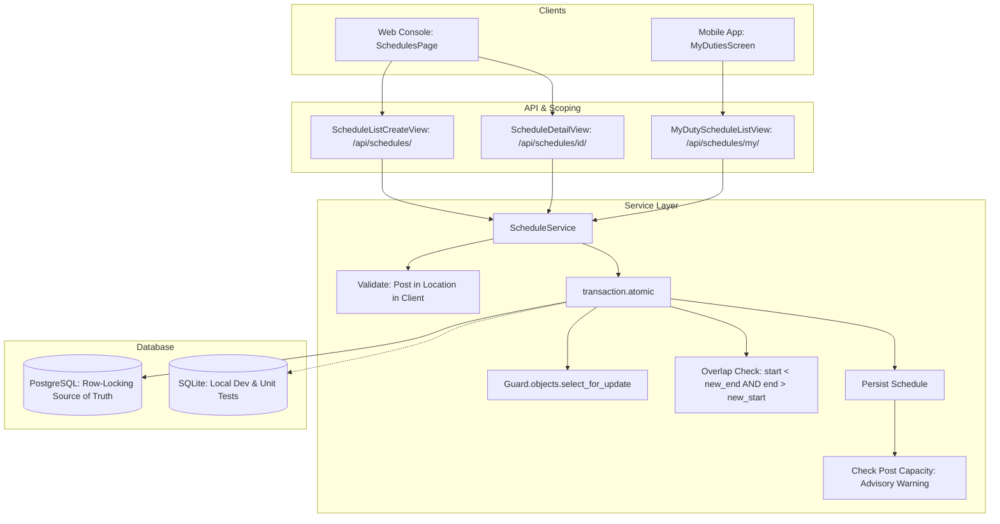

# Phase 4: Duty Scheduling Implementation Plan

> **For agentic workers:** REQUIRED SUB-SKILL: Use superpowers:subagent-driven-development to implement this plan task-by-task. Steps use checkbox (`- [ ]`) syntax for tracking.

**Goal:** Build a robust, race-condition-safe duty scheduling system that assigns security guards to specific posts at client site locations, enforces temporal overlap prevention (`shift_start < new_end AND shift_end > new_start`) via PostgreSQL row locks, and delivers interactive Web and Mobile interfaces.

**Architecture:** A transactional `ScheduleService` in Django centralizes all scheduling operations, executing `Guard.objects.select_for_update()` inside `transaction.atomic()` to prevent concurrent double-booking. REST endpoints expose server-side role-scoped schedules (`/api/schedules/`) and guard-specific upcoming shifts (`/api/schedules/my/`). The Web Console provides a hybrid table and daily timeline view with cascading selectors, while the Mobile App delivers a live duty feed with active-shift highlighting (`shift_start <= now < shift_end`).

**Architecture Diagram:**



**Tech Stack:** Python 3.10+, Django 5.2, Django REST Framework, PostgreSQL / SQLite, Pytest, React 18, Vite, Tailwind CSS, Lucide React, React Native, Expo SDK 57.

**Spec:** [docs/superpowers/specs/2026-10-04-phase-4-duty-scheduling-design.md](file:///d:/Security_System/Security_Agency_Management_System/docs/superpowers/specs/2026-10-04-phase-4-duty-scheduling-design.md)

## Global Constraints

- Response Envelope: Every endpoint returns `{ success, data, error }`.
- Overlap Rule: Reject when `shift_start < new_end AND shift_end > new_start` for active `SCHEDULED` shifts of the same guard.
- Conflict Code: Return HTTP 409 with machine code `SCHEDULE_CONFLICT` and detailed clashing times on both create and update.
- Current Shift Detection: Evaluated as `shift_start <= now < shift_end`.
- Concurrency Source of Truth: PostgreSQL row locks (`select_for_update()`); SQLite documented as development/unit test runtime.
- Post Capacity: Calculated after schedule persistence in the database; non-blocking advisory warning attached to HTTP 201/200 response.
- UI Compliance: 0 failures on `python scripts/check_ui_rules.py`. Solid colors, 4-8px button radii, Lucide icons only, no emoji, no em dashes, no exclamation marks.

---

## Tasks

### Task 1: Data Model Updates & Migration for `DutySchedule`

**Files:**
- Modify: `backend/apps/schedules/models.py`
- Create: `backend/apps/schedules/migrations/0002_dutieschedule_client_post_and_indexes.py`
- Test: `backend/tests/test_schedules_models.py`

**Interfaces:**
- Consumes: `apps.clients.models.Client`, `apps.locations.models.Post`, `apps.locations.models.Location`, `apps.guards.models.Guard`
- Produces: `DutySchedule` model with foreign keys to `client`, `location`, `post`, `guard`, status choices (`SCHEDULED`, `CANCELLED`, `COMPLETED`), and exact approved indexes (guard+times, location+time, status+time).

- [ ] **Step 1: Write the failing test for model fields and indexes**

Create `backend/tests/test_schedules_models.py`:
```python
import pytest
from django.utils import timezone
from apps.schedules.models import DutySchedule
from apps.clients.models import Client
from apps.locations.models import Location, Post
from apps.guards.models import Guard

@pytest.mark.django_db
def test_duty_schedule_fields_and_relationships(guard_profile, location_a, admin_user):
    client = Client.objects.create(
        company_name="Alpha Corp",
        contact_person="Alice",
        phone="1112223333",
        email="alice@alpha.local",
        user=admin_user,
    )
    location_a.client = client
    location_a.save()
    post = Post.objects.create(name="Gate 1", location=location_a, required_guard_count=1)

    now = timezone.now()
    schedule = DutySchedule.objects.create(
        guard=guard_profile,
        client=client,
        location=location_a,
        post=post,
        shift_start=now,
        shift_end=now + timezone.timedelta(hours=8),
        status=DutySchedule.Status.SCHEDULED,
        created_by=admin_user,
    )

    assert schedule.client == client
    assert schedule.post == post
    assert schedule.location == location_a
    assert schedule.guard == guard_profile
    assert schedule.status == DutySchedule.Status.SCHEDULED
```

- [ ] **Step 2: Run test to verify it fails**

Run:
```powershell
cd backend
pytest tests/test_schedules_models.py -v
```
Expected: FAIL with `TypeError: DutySchedule() got unexpected keyword argument 'client'` or missing attributes.

- [ ] **Step 3: Update `backend/apps/schedules/models.py` and run migrations**

Modify `backend/apps/schedules/models.py` (keeping strictly the 3 approved indexes from the design specification):
```python
from django.conf import settings
from django.db import models


class DutySchedule(models.Model):
    """A scheduled shift: guard + client + location + post + time window."""

    class Status(models.TextChoices):
        SCHEDULED = "SCHEDULED", "Scheduled"
        CANCELLED = "CANCELLED", "Cancelled"
        COMPLETED = "COMPLETED", "Completed"

    guard = models.ForeignKey(
        "guards.Guard", on_delete=models.CASCADE, related_name="schedules"
    )
    client = models.ForeignKey(
        "clients.Client", on_delete=models.CASCADE, related_name="schedules"
    )
    location = models.ForeignKey(
        "locations.Location",
        on_delete=models.CASCADE,
        related_name="schedules",
        verbose_name="Site Location",
    )
    post = models.ForeignKey(
        "locations.Post", on_delete=models.CASCADE, related_name="schedules"
    )
    shift_start = models.DateTimeField()
    shift_end = models.DateTimeField()
    status = models.CharField(
        max_length=20, choices=Status.choices, default=Status.SCHEDULED
    )
    created_by = models.ForeignKey(
        settings.AUTH_USER_MODEL,
        on_delete=models.SET_NULL,
        null=True,
        related_name="created_schedules",
    )
    created_at = models.DateTimeField(auto_now_add=True)
    updated_at = models.DateTimeField(auto_now=True)

    class Meta:
        db_table = "duty_schedules"
        indexes = [
            models.Index(fields=["guard", "shift_start", "shift_end"], name="duty_sched_guard_time_idx"),
            models.Index(fields=["location", "shift_start"], name="duty_sched_loc_time_idx"),
            models.Index(fields=["status", "shift_start"], name="duty_sched_status_time_idx"),
        ]

    def __str__(self):
        return f"{self.guard} @ {self.location} ({self.shift_start})"
```

Run migration commands:
```powershell
python manage.py makemigrations schedules
python manage.py migrate
```

- [ ] **Step 4: Run test to verify it passes**

Run:
```powershell
pytest tests/test_schedules_models.py -v
```
Expected: PASS.

- [ ] **Step 5: Commit**

```powershell
git add apps/schedules/models.py apps/schedules/migrations/ tests/test_schedules_models.py
git commit -m "feat(schedules): add client, post, status choices, and approved indexes to DutySchedule"
```

---

### Task 2: Implement `ScheduleService` with Transactional Overlap Prevention & Clean Contract

**Files:**
- Create: `backend/apps/schedules/exceptions.py`
- Create: `backend/apps/schedules/services.py`
- Test: `backend/tests/test_schedules_service.py`

**Interfaces:**
- Consumes: `DutySchedule`, `Guard`, `Location`, `Post`, `Client`
- Produces: `ScheduleService.create_schedule()`, `ScheduleService.update_schedule()`, `ScheduleService.cancel_schedule()`, raising `ScheduleConflictError` on overlap. Returns `(schedule_instance, advisory_warning)`.

- [ ] **Step 1: Write the failing tests for ScheduleService**

Create `backend/tests/test_schedules_service.py`:
```python
import pytest
from datetime import timedelta
from django.utils import timezone
from django.core.exceptions import ValidationError
from apps.clients.models import Client
from apps.locations.models import Location, Post
from apps.guards.models import Guard
from apps.schedules.models import DutySchedule
from apps.schedules.services import ScheduleService
from apps.schedules.exceptions import ScheduleConflictError

@pytest.fixture
def schedule_setup(db, guard_profile, admin_user):
    client = Client.objects.create(
        company_name="Metro Corp",
        contact_person="Bob",
        phone="2223334444",
        email="bob@metro.local",
        user=admin_user,
    )
    loc = Location.objects.create(
        name="Metro Yard",
        client=client,
        address="100 Metro Rd",
        latitude="17.44",
        longitude="78.37",
        radius_m=100,
    )
    post = Post.objects.create(name="Entry Gate", location=loc, required_guard_count=1)
    return client, loc, post, guard_profile, admin_user

@pytest.mark.django_db
def test_create_schedule_success(schedule_setup):
    client, loc, post, guard, admin = schedule_setup
    now = timezone.now().replace(minute=0, second=0, microsecond=0)
    sched, warning = ScheduleService.create_schedule(
        client=client,
        location=loc,
        post=post,
        guard=guard,
        shift_start=now,
        shift_end=now + timedelta(hours=8),
        created_by=admin,
    )
    assert sched.id is not None
    assert sched.status == DutySchedule.Status.SCHEDULED
    assert warning is None

@pytest.mark.django_db
def test_overlap_matrix_rejection(schedule_setup):
    client, loc, post, guard, admin = schedule_setup
    now = timezone.now().replace(minute=0, second=0, microsecond=0)
    s_start = now + timedelta(hours=8)
    s_end = now + timedelta(hours=16)
    ScheduleService.create_schedule(client=client, location=loc, post=post, guard=guard, shift_start=s_start, shift_end=s_end, created_by=admin)

    # 1. Identical
    with pytest.raises(ScheduleConflictError):
        ScheduleService.create_schedule(client=client, location=loc, post=post, guard=guard, shift_start=s_start, shift_end=s_end)

    # 2. Starts inside
    with pytest.raises(ScheduleConflictError):
        ScheduleService.create_schedule(client=client, location=loc, post=post, guard=guard, shift_start=s_start + timedelta(hours=2), shift_end=s_end + timedelta(hours=2))

    # 3. Ends inside
    with pytest.raises(ScheduleConflictError):
        ScheduleService.create_schedule(client=client, location=loc, post=post, guard=guard, shift_start=s_start - timedelta(hours=2), shift_end=s_end - timedelta(hours=2))

    # 4. Encompasses
    with pytest.raises(ScheduleConflictError):
        ScheduleService.create_schedule(client=client, location=loc, post=post, guard=guard, shift_start=s_start - timedelta(hours=1), shift_end=s_end + timedelta(hours=1))

    # 5. Contained inside
    with pytest.raises(ScheduleConflictError):
        ScheduleService.create_schedule(client=client, location=loc, post=post, guard=guard, shift_start=s_start + timedelta(hours=1), shift_end=s_end - timedelta(hours=1))

@pytest.mark.django_db
def test_back_to_back_and_cancelled_allowed(schedule_setup):
    client, loc, post, guard, admin = schedule_setup
    now = timezone.now().replace(minute=0, second=0, microsecond=0)
    s_start = now + timedelta(hours=8)
    s_end = now + timedelta(hours=16)
    s1, _ = ScheduleService.create_schedule(client=client, location=loc, post=post, guard=guard, shift_start=s_start, shift_end=s_end, created_by=admin)

    # Back-to-back: starts exactly when s1 ends
    s2, _ = ScheduleService.create_schedule(client=client, location=loc, post=post, guard=guard, shift_start=s_end, shift_end=s_end + timedelta(hours=8), created_by=admin)
    assert s2.id is not None

    # Cancel s1, then create overlapping shift in same slot
    ScheduleService.cancel_schedule(s1)
    s3, _ = ScheduleService.create_schedule(client=client, location=loc, post=post, guard=guard, shift_start=s_start, shift_end=s_end, created_by=admin)
    assert s3.id is not None
```

- [ ] **Step 2: Run test to verify it fails**

Run:
```powershell
pytest tests/test_schedules_service.py -v
```
Expected: FAIL with `ModuleNotFoundError: No module named 'apps.schedules.services'`.

- [ ] **Step 3: Implement exceptions and ScheduleService with explicit update semantics and post-save capacity calculation**

Create `backend/apps/schedules/exceptions.py`:
```python
class ScheduleConflictError(Exception):
    """Raised when a proposed shift conflicts with an existing active shift."""

    def __init__(self, message, conflicting_schedule=None):
        super().__init__(message)
        self.message = message
        self.conflicting_schedule = conflicting_schedule
```

Create `backend/apps/schedules/services.py`:
```python
from django.db import transaction
from django.core.exceptions import ValidationError
from apps.guards.models import Guard
from apps.schedules.models import DutySchedule
from apps.schedules.exceptions import ScheduleConflictError


class ScheduleService:
    @staticmethod
    def validate_relationships(client, location, post, guard, shift_start, shift_end):
        if shift_end <= shift_start:
            raise ValidationError("Shift end time must be later than shift start time.")

        if guard.status != Guard.Status.ACTIVE:
            raise ValidationError("Cannot assign shifts to an inactive guard.")

        if post.location_id != location.id:
            raise ValidationError("Selected post does not belong to the selected site location.")

        if location.client_id != client.id:
            raise ValidationError("Selected site location does not belong to the selected client.")

    @staticmethod
    def calculate_post_capacity_warning(post, shift_start, shift_end):
        """
        Calculates whether the post's required capacity is exceeded based on the
        current database state. Strictly advisory and non-blocking.
        """
        overlapping_count = DutySchedule.objects.filter(
            post=post,
            status=DutySchedule.Status.SCHEDULED,
            shift_start__lt=shift_end,
            shift_end__gt=shift_start,
        ).count()

        if overlapping_count > post.required_guard_count:
            return (
                f"Post required guard count ({post.required_guard_count}) is exceeded "
                f"({overlapping_count} currently assigned)."
            )
        return None

    @classmethod
    def create_schedule(cls, client, location, post, guard, shift_start, shift_end, created_by=None):
        cls.validate_relationships(client, location, post, guard, shift_start, shift_end)

        with transaction.atomic():
            # Concurrency Note: select_for_update() locks the Guard row on PostgreSQL,
            # serializing overlapping booking attempts. On SQLite, row locking is a no-op.
            locked_guard = Guard.objects.select_for_update().get(pk=guard.pk)

            conflict = DutySchedule.objects.filter(
                guard=locked_guard,
                status=DutySchedule.Status.SCHEDULED,
                shift_start__lt=shift_end,
                shift_end__gt=shift_start,
            ).select_related("location", "post").first()

            if conflict:
                raise ScheduleConflictError(
                    message=(
                        f"Guard is already scheduled from "
                        f"{conflict.shift_start.strftime('%Y-%m-%d %H:%M')} to "
                        f"{conflict.shift_end.strftime('%H:%M')} at {conflict.location.name} "
                        f"({conflict.post.name})."
                    ),
                    conflicting_schedule=conflict,
                )

            schedule = DutySchedule.objects.create(
                guard=locked_guard,
                client=client,
                location=location,
                post=post,
                shift_start=shift_start,
                shift_end=shift_end,
                status=DutySchedule.Status.SCHEDULED,
                created_by=created_by,
            )

            # Capacity warning calculated from final committed database state
            advisory_warning = cls.calculate_post_capacity_warning(post, shift_start, shift_end)

        return schedule, advisory_warning

    @classmethod
    def update_schedule(cls, instance, data):
        """
        Updates an existing schedule. Uses explicit key checks (no 'or' fallback semantics)
        and locks both current and newly assigned guards to prevent race conditions.
        """
        client = data["client"] if "client" in data else instance.client
        location = data["location"] if "location" in data else instance.location
        post = data["post"] if "post" in data else instance.post
        target_guard = data["guard"] if "guard" in data else instance.guard
        shift_start = data["shift_start"] if "shift_start" in data else instance.shift_start
        shift_end = data["shift_end"] if "shift_end" in data else instance.shift_end

        cls.validate_relationships(client, location, post, target_guard, shift_start, shift_end)

        with transaction.atomic():
            # Lock the guard row(s). If guard changed, sort IDs to prevent deadlocks
            guard_ids_to_lock = sorted(list({instance.guard_id, target_guard.id}))
            locked_guards = {g.id: g for g in Guard.objects.select_for_update().filter(pk__in=guard_ids_to_lock)}
            locked_target_guard = locked_guards[target_guard.id]

            conflict = DutySchedule.objects.filter(
                guard=locked_target_guard,
                status=DutySchedule.Status.SCHEDULED,
                shift_start__lt=shift_end,
                shift_end__gt=shift_start,
            ).exclude(pk=instance.id).select_related("location", "post").first()

            if conflict:
                raise ScheduleConflictError(
                    message=(
                        f"Guard is already scheduled from "
                        f"{conflict.shift_start.strftime('%Y-%m-%d %H:%M')} to "
                        f"{conflict.shift_end.strftime('%H:%M')} at {conflict.location.name} "
                        f"({conflict.post.name})."
                    ),
                    conflicting_schedule=conflict,
                )

            instance.client = client
            instance.location = location
            instance.post = post
            instance.guard = locked_target_guard
            instance.shift_start = shift_start
            instance.shift_end = shift_end
            instance.save()

            # Capacity warning calculated from final state after update
            advisory_warning = cls.calculate_post_capacity_warning(post, shift_start, shift_end)

        return instance, advisory_warning

    @staticmethod
    def cancel_schedule(instance):
        instance.status = DutySchedule.Status.CANCELLED
        instance.save(update_fields=["status", "updated_at"])
        return instance
```

- [ ] **Step 4: Run test to verify it passes**

Run:
```powershell
pytest tests/test_schedules_service.py -v
```
Expected: PASS.

- [ ] **Step 5: Commit**

```powershell
git add apps/schedules/exceptions.py apps/schedules/services.py tests/test_schedules_service.py
git commit -m "feat(schedules): implement ScheduleService with robust update locking and post-save capacity warning"
```

---

### Task 3: Serializers with Clean Service Contract

**Files:**
- Create: `backend/apps/schedules/serializers.py`
- Test: `backend/tests/test_schedules_serializers.py`

**Interfaces:**
- Consumes: `DutySchedule`, `ScheduleService`
- Produces: `DutyScheduleSerializer` (read representation), `DutyScheduleCreateUpdateSerializer` (standard DRF serializer that returns model instance and sets `serializer.advisory_warning`).

- [ ] **Step 1: Write the failing serializer test**

Create `backend/tests/test_schedules_serializers.py`:
```python
import pytest
from datetime import timedelta
from django.utils import timezone
from apps.schedules.serializers import DutyScheduleSerializer, DutyScheduleCreateUpdateSerializer

@pytest.mark.django_db
def test_schedule_serializers(schedule_setup):
    client, loc, post, guard, admin = schedule_setup
    now = timezone.now().replace(minute=0, second=0, microsecond=0)

    data = {
        "client": client.id,
        "location": loc.id,
        "post": post.id,
        "guard": guard.id,
        "shift_start": now.isoformat(),
        "shift_end": (now + timedelta(hours=8)).isoformat(),
    }
    ser = DutyScheduleCreateUpdateSerializer(data=data, context={"request_user": admin})
    assert ser.is_valid(), ser.errors
    instance = ser.save()

    assert instance.id is not None
    assert hasattr(ser, "advisory_warning")

    read_ser = DutyScheduleSerializer(instance)
    assert read_ser.data["id"] == instance.id
    assert read_ser.data["guard"]["id"] == guard.id
    assert read_ser.data["location"]["id"] == loc.id
    assert read_ser.data["post"]["id"] == post.id
```

- [ ] **Step 2: Run test to verify it fails**

Run:
```powershell
pytest tests/test_schedules_serializers.py -v
```
Expected: FAIL with `ModuleNotFoundError: No module named 'apps.schedules.serializers'`.

- [ ] **Step 3: Implement `backend/apps/schedules/serializers.py`**

Create `backend/apps/schedules/serializers.py`:
```python
from rest_framework import serializers
from apps.schedules.models import DutySchedule
from apps.schedules.services import ScheduleService
from apps.guards.serializers import GuardSerializer
from apps.locations.serializers import LocationSerializer, PostSerializer
from apps.clients.serializers import ClientSerializer


class DutyScheduleSerializer(serializers.ModelSerializer):
    guard = GuardSerializer(read_only=True)
    client = ClientSerializer(read_only=True)
    location = LocationSerializer(read_only=True)
    post = PostSerializer(read_only=True)

    class Meta:
        model = DutySchedule
        fields = [
            "id",
            "guard",
            "client",
            "location",
            "post",
            "shift_start",
            "shift_end",
            "status",
            "created_at",
            "updated_at",
        ]


class DutyScheduleCreateUpdateSerializer(serializers.ModelSerializer):
    class Meta:
        model = DutySchedule
        fields = [
            "id",
            "client",
            "location",
            "post",
            "guard",
            "shift_start",
            "shift_end",
        ]

    def create(self, validated_data):
        created_by = self.context.get("request_user")
        instance, warning = ScheduleService.create_schedule(
            client=validated_data["client"],
            location=validated_data["location"],
            post=validated_data["post"],
            guard=validated_data["guard"],
            shift_start=validated_data["shift_start"],
            shift_end=validated_data["shift_end"],
            created_by=created_by,
        )
        self.advisory_warning = warning
        return instance

    def update(self, instance, validated_data):
        updated_instance, warning = ScheduleService.update_schedule(
            instance=instance,
            data=validated_data,
        )
        self.advisory_warning = warning
        return updated_instance
```

- [ ] **Step 4: Run test to verify it passes**

Run:
```powershell
pytest tests/test_schedules_serializers.py -v
```
Expected: PASS.

- [ ] **Step 5: Commit**

```powershell
git add apps/schedules/serializers.py tests/test_schedules_serializers.py
git commit -m "feat(schedules): add DutySchedule serializers conforming to standard save contract"
```

---

### Task 4: API Views, Server-Side Scoping & Structured Conflict Handling

**Files:**
- Create: `backend/apps/schedules/views.py`
- Create: `backend/apps/schedules/urls.py`
- Modify: `backend/config/urls.py`
- Test: `backend/tests/test_schedules_views.py`

**Interfaces:**
- Consumes: `DutyScheduleSerializer`, `DutyScheduleCreateUpdateSerializer`, `ScheduleService`, `get_supervisor_location_ids()`, `get_client_location_ids()`
- Produces: `/api/schedules/`, `/api/schedules/{id}/`, `/api/schedules/{id}/cancel/`, `/api/schedules/my/` with strict server-side scoping and structured HTTP 409 conflict errors on both create and update.

- [ ] **Step 1: Write failing tests for views, scoping, and conflict responses**

Create `backend/tests/test_schedules_views.py`:
```python
import pytest
from datetime import timedelta
from django.utils import timezone
from rest_framework import status
from apps.accounts.models import User
from apps.locations.models import SupervisorAssignment

@pytest.mark.django_db
def test_admin_schedule_crud_and_conflict(api_client, admin_user, schedule_setup):
    client, loc, post, guard, _ = schedule_setup
    api_client.force_authenticate(user=admin_user)
    now = timezone.now().replace(minute=0, second=0, microsecond=0)

    # 1. Create Shift
    payload = {
        "client": client.id,
        "location": loc.id,
        "post": post.id,
        "guard": guard.id,
        "shift_start": now.isoformat(),
        "shift_end": (now + timedelta(hours=8)).isoformat(),
    }
    res = api_client.post("/api/schedules/", payload)
    assert res.status_code == status.HTTP_201_CREATED
    assert res.data["success"] is True
    sched_id = res.data["data"]["schedule"]["id"]

    # 2. Duplicate overlap -> 409 with structured details
    res_conflict = api_client.post("/api/schedules/", payload)
    assert res_conflict.status_code == status.HTTP_409_CONFLICT
    assert res_conflict.data["success"] is False
    assert res_conflict.data["error"]["code"] == "SCHEDULE_CONFLICT"
    assert res_conflict.data["error"]["conflicting_schedule"]["id"] == sched_id

    # 3. Cancel Shift
    res_cancel = api_client.post(f"/api/schedules/{sched_id}/cancel/")
    assert res_cancel.status_code == status.HTTP_200_OK

@pytest.mark.django_db
def test_role_scoping_and_detail_protection(api_client, supervisor_user, guard_user, schedule_setup):
    client, loc, post, guard, admin = schedule_setup
    now = timezone.now().replace(minute=0, second=0, microsecond=0)
    api_client.force_authenticate(user=admin)
    payload = {
        "client": client.id,
        "location": loc.id,
        "post": post.id,
        "guard": guard.id,
        "shift_start": (now + timedelta(hours=1)).isoformat(),
        "shift_end": (now + timedelta(hours=9)).isoformat(),
    }
    res = api_client.post("/api/schedules/", payload)
    assert res.status_code == status.HTTP_201_CREATED
    sched_id = res.data["data"]["schedule"]["id"]

    # Guard forbidden on main endpoint
    api_client.force_authenticate(user=guard_user)
    assert api_client.get("/api/schedules/").status_code == status.HTTP_403_FORBIDDEN

    # Guard allowed on /my/
    res_my = api_client.get("/api/schedules/my/")
    assert res_my.status_code == status.HTTP_200_OK
    assert len(res_my.data["data"]) == 1

    # Supervisor unassigned cannot see or retrieve schedule (404)
    api_client.force_authenticate(user=supervisor_user)
    assert api_client.get(f"/api/schedules/{sched_id}/").status_code == status.HTTP_404_NOT_FOUND

    # Supervisor assigned can retrieve schedule
    SupervisorAssignment.objects.create(supervisor=supervisor_user, location=loc, is_active=True)
    assert api_client.get(f"/api/schedules/{sched_id}/").status_code == status.HTTP_200_OK
```

- [ ] **Step 2: Run test to verify it fails**

Run:
```powershell
pytest tests/test_schedules_views.py -v
```
Expected: FAIL with 404 (URLs not registered).

- [ ] **Step 3: Implement views and URLs**

Create `backend/apps/schedules/views.py`:
```python
from rest_framework import generics, status, permissions
from rest_framework.response import Response
from django.utils import timezone
from django.core.exceptions import ValidationError
from apps.accounts.models import User
from apps.accounts.permissions import IsAdminOrSupervisor, IsClient, IsGuard
from apps.locations.scoping import get_supervisor_location_ids, get_client_location_ids
from apps.schedules.models import DutySchedule
from apps.schedules.serializers import DutyScheduleSerializer, DutyScheduleCreateUpdateSerializer
from apps.schedules.services import ScheduleService
from apps.schedules.exceptions import ScheduleConflictError
from common.pagination import StandardResultsSetPagination


class ScheduleListCreateView(generics.ListCreateAPIView):
    pagination_class = StandardResultsSetPagination

    def get_permissions(self):
        if self.request.method == "POST":
            return [permissions.IsAuthenticated(), IsAdminOrSupervisor()]
        return [permissions.IsAuthenticated()]

    def get_queryset(self):
        user = self.request.user
        if user.role == User.Role.GUARD:
            return DutySchedule.objects.none()

        qs = DutySchedule.objects.select_related("guard", "client", "location", "post").order_by("-shift_start")

        # Enforce server-side role scoping
        if user.role == User.Role.SUPERVISOR:
            allowed_locs = get_supervisor_location_ids(user)
            qs = qs.filter(location_id__in=allowed_locs)
        elif user.role == User.Role.CLIENT:
            allowed_locs = get_client_location_ids(user)
            qs = qs.filter(location_id__in=allowed_locs)

        # Filters
        client_id = self.request.query_params.get("client_id")
        if client_id:
            qs = qs.filter(client_id=client_id)

        location_id = self.request.query_params.get("location_id")
        if location_id:
            qs = qs.filter(location_id=location_id)

        post_id = self.request.query_params.get("post_id")
        if post_id:
            qs = qs.filter(post_id=post_id)

        guard_id = self.request.query_params.get("guard_id")
        if guard_id:
            qs = qs.filter(guard_id=guard_id)

        status_val = self.request.query_params.get("status")
        if status_val:
            qs = qs.filter(status=status_val)

        date_val = self.request.query_params.get("date")
        if date_val:
            qs = qs.filter(shift_start__date=date_val)

        return qs

    def list(self, request, *args, **kwargs):
        if request.user.role == User.Role.GUARD:
            return Response(
                {"success": False, "data": None, "error": {"code": "FORBIDDEN", "message": "Guards must access /api/schedules/my/."}},
                status=status.HTTP_403_FORBIDDEN,
            )
        queryset = self.filter_queryset(self.get_queryset())
        page = self.paginate_queryset(queryset)
        if page is not None:
            serializer = DutyScheduleSerializer(page, many=True)
            return self.get_paginated_response(serializer.data)

        serializer = DutyScheduleSerializer(queryset, many=True)
        return Response({"success": True, "data": serializer.data, "error": None})

    def create(self, request, *args, **kwargs):
        serializer = DutyScheduleCreateUpdateSerializer(data=request.data, context={"request_user": request.user})
        if not serializer.is_valid():
            return Response({"success": False, "data": None, "error": {"code": "VALIDATION_ERROR", "details": serializer.errors}}, status=status.HTTP_400_BAD_REQUEST)

        # Enforce supervisor assignment boundary on creation
        if request.user.role == User.Role.SUPERVISOR:
            allowed_locs = get_supervisor_location_ids(request.user)
            if serializer.validated_data["location"].id not in allowed_locs:
                return Response({"success": False, "data": None, "error": {"code": "FORBIDDEN", "message": "You cannot schedule shifts for an unassigned site."}}, status=status.HTTP_403_FORBIDDEN)

        try:
            instance = serializer.save()
            warning = getattr(serializer, "advisory_warning", None)
            data = DutyScheduleSerializer(instance).data
            return Response({"success": True, "data": {"schedule": data, "warning": warning}, "error": None}, status=status.HTTP_201_CREATED)
        except ScheduleConflictError as e:
            conflict_data = None
            if e.conflicting_schedule:
                conflict_data = {
                    "id": e.conflicting_schedule.id,
                    "shift_start": e.conflicting_schedule.shift_start.isoformat(),
                    "shift_end": e.conflicting_schedule.shift_end.isoformat(),
                    "location_name": e.conflicting_schedule.location.name,
                    "post_name": e.conflicting_schedule.post.name,
                }
            return Response(
                {"success": False, "data": None, "error": {"code": "SCHEDULE_CONFLICT", "message": e.message, "conflicting_schedule": conflict_data}},
                status=status.HTTP_409_CONFLICT,
            )
        except ValidationError as e:
            return Response({"success": False, "data": None, "error": {"code": "VALIDATION_ERROR", "message": str(e)}}, status=status.HTTP_400_BAD_REQUEST)


class ScheduleDetailView(generics.RetrieveUpdateAPIView):
    serializer_class = DutyScheduleSerializer

    def get_permissions(self):
        if self.request.method in ["PUT", "PATCH"]:
            return [permissions.IsAuthenticated(), IsAdminOrSupervisor()]
        return [permissions.IsAuthenticated()]

    def get_queryset(self):
        user = self.request.user
        if user.role == User.Role.GUARD:
            return DutySchedule.objects.none()

        qs = DutySchedule.objects.select_related("guard", "client", "location", "post")
        if user.role == User.Role.SUPERVISOR:
            allowed_locs = get_supervisor_location_ids(user)
            return qs.filter(location_id__in=allowed_locs)
        elif user.role == User.Role.CLIENT:
            allowed_locs = get_client_location_ids(user)
            return qs.filter(location_id__in=allowed_locs)
        return qs

    def update(self, request, *args, **kwargs):
        if request.user.role == User.Role.CLIENT:
            return Response({"success": False, "data": None, "error": {"code": "FORBIDDEN", "message": "Clients cannot update duty schedules."}}, status=status.HTTP_403_FORBIDDEN)

        instance = self.get_object()
        serializer = DutyScheduleCreateUpdateSerializer(instance, data=request.data, partial=True, context={"request_user": request.user})
        if not serializer.is_valid():
            return Response({"success": False, "data": None, "error": {"code": "VALIDATION_ERROR", "details": serializer.errors}}, status=status.HTTP_400_BAD_REQUEST)

        # Prevent supervisor from transferring shift to an unassigned location
        if request.user.role == User.Role.SUPERVISOR and "location" in serializer.validated_data:
            allowed_locs = get_supervisor_location_ids(request.user)
            if serializer.validated_data["location"].id not in allowed_locs:
                return Response({"success": False, "data": None, "error": {"code": "FORBIDDEN", "message": "Cannot reassign shift to an unassigned site."}}, status=status.HTTP_403_FORBIDDEN)

        try:
            updated_instance = serializer.save()
            warning = getattr(serializer, "advisory_warning", None)
            data = DutyScheduleSerializer(updated_instance).data
            return Response({"success": True, "data": {"schedule": data, "warning": warning}, "error": None}, status=status.HTTP_200_OK)
        except ScheduleConflictError as e:
            conflict_data = None
            if e.conflicting_schedule:
                conflict_data = {
                    "id": e.conflicting_schedule.id,
                    "shift_start": e.conflicting_schedule.shift_start.isoformat(),
                    "shift_end": e.conflicting_schedule.shift_end.isoformat(),
                    "location_name": e.conflicting_schedule.location.name,
                    "post_name": e.conflicting_schedule.post.name,
                }
            return Response(
                {"success": False, "data": None, "error": {"code": "SCHEDULE_CONFLICT", "message": e.message, "conflicting_schedule": conflict_data}},
                status=status.HTTP_409_CONFLICT,
            )
        except ValidationError as e:
            return Response({"success": False, "data": None, "error": {"code": "VALIDATION_ERROR", "message": str(e)}}, status=status.HTTP_400_BAD_REQUEST)


class ScheduleCancelView(generics.GenericAPIView):
    permission_classes = [permissions.IsAuthenticated, IsAdminOrSupervisor]

    def get_queryset(self):
        user = self.request.user
        qs = DutySchedule.objects.all()
        if user.role == User.Role.SUPERVISOR:
            allowed_locs = get_supervisor_location_ids(user)
            return qs.filter(location_id__in=allowed_locs)
        return qs

    def post(self, request, pk=None):
        instance = self.get_object()
        ScheduleService.cancel_schedule(instance)
        return Response({"success": True, "data": {"id": instance.id, "status": instance.status}, "error": None})


class MyDutyScheduleListView(generics.ListAPIView):
    permission_classes = [permissions.IsAuthenticated, IsGuard]

    def list(self, request, *args, **kwargs):
        guard_profile = getattr(request.user, "guard_profile", None)
        if not guard_profile:
            return Response({"success": True, "data": [], "error": None})

        now = timezone.now()
        schedules = (
            DutySchedule.objects.filter(
                guard=guard_profile,
                status=DutySchedule.Status.SCHEDULED,
                shift_end__gte=now,
            )
            .select_related("client", "location", "post")
            .order_by("shift_start")
        )
        serializer = DutyScheduleSerializer(schedules, many=True)
        return Response({"success": True, "data": serializer.data, "error": None})
```

Create `backend/apps/schedules/urls.py`:
```python
from django.urls import path
from apps.schedules.views import (
    ScheduleListCreateView,
    ScheduleDetailView,
    ScheduleCancelView,
    MyDutyScheduleListView,
)

urlpatterns = [
    path("schedules/", ScheduleListCreateView.as_view(), name="schedule-list-create"),
    path("schedules/<int:pk>/", ScheduleDetailView.as_view(), name="schedule-detail"),
    path("schedules/<int:pk>/cancel/", ScheduleCancelView.as_view(), name="schedule-cancel"),
    path("schedules/my/", MyDutyScheduleListView.as_view(), name="my-schedules"),
]
```

Modify `backend/config/urls.py` to register `apps.schedules.urls`:
```python
    path("api/", include("apps.schedules.urls")),
```

- [ ] **Step 4: Run test to verify it passes**

Run:
```powershell
pytest tests/test_schedules_views.py -v
```
Expected: PASS.

- [ ] **Step 5: Commit**

```powershell
git add apps/schedules/views.py apps/schedules/urls.py config/urls.py tests/test_schedules_views.py
git commit -m "feat(schedules): add REST API endpoints with server-side role scoping and structured 409 error responses"
```

---

### Task 5: PostgreSQL Concurrency Verification Test

**Files:**
- Create: `backend/tests/test_schedules_concurrency.py`

**Interfaces:**
- Consumes: `ScheduleService`, `ThreadPoolExecutor`
- Produces: True multi-threaded test explicitly verifying PostgreSQL row-level locks, with proper connection cleanup in spawned threads and explicit skipping on SQLite.

- [ ] **Step 1: Write concurrency test**

Create `backend/tests/test_schedules_concurrency.py`:
```python
import pytest
from datetime import timedelta
from concurrent.futures import ThreadPoolExecutor
from django.db import connection
from django.utils import timezone
from apps.schedules.services import ScheduleService
from apps.schedules.exceptions import ScheduleConflictError

@pytest.mark.django_db(transaction=True)
def test_concurrent_schedule_booking_race_condition(schedule_setup):
    """
    Test multi-threaded race condition when two requests try to book the same guard.
    PostgreSQL serializes via select_for_update() row locks.
    Explicitly skipped when running on SQLite because SQLite locks at table/file level.
    """
    if connection.vendor != "postgresql":
        pytest.skip("Row-level locking concurrency test requires PostgreSQL database engine.")

    client, loc, post, guard, admin = schedule_setup
    now = timezone.now().replace(minute=0, second=0, microsecond=0)
    s_start = now + timedelta(hours=10)
    s_end = now + timedelta(hours=18)

    results = []
    errors = []

    def book_shift():
        # Dedicated DB connection per thread
        connection.connect()
        try:
            sched, _ = ScheduleService.create_schedule(
                client=client,
                location=loc,
                post=post,
                guard=guard,
                shift_start=s_start,
                shift_end=s_end,
                created_by=admin,
            )
            results.append(sched)
        except ScheduleConflictError as e:
            errors.append(e)
        except Exception as e:
            errors.append(e)
        finally:
            connection.close()

    with ThreadPoolExecutor(max_workers=2) as executor:
        f1 = executor.submit(book_shift)
        f2 = executor.submit(book_shift)
        f1.result()
        f2.result()

    # Exactly one must succeed
    assert len(results) == 1, f"Expected 1 success, got {len(results)}"
    assert len(errors) == 1, f"Expected 1 conflict error, got {len(errors)}"
    assert isinstance(errors[0], ScheduleConflictError)
```

- [ ] **Step 2: Run test to verify it passes (or skips on SQLite)**

Run:
```powershell
pytest tests/test_schedules_concurrency.py -v
```
Expected: PASS (or SKIPPED with message if run against SQLite).

- [ ] **Step 3: Commit**

```powershell
git add tests/test_schedules_concurrency.py
git commit -m "test(schedules): add PostgreSQL row-lock concurrency test with connection lifecycle cleanup"
```

---

### Task 6: Update Seed Data (`seed_demo.py`) with Client and Post Distribution

**Files:**
- Modify: `backend/apps/accounts/management/commands/seed_demo.py:203-220`
- Test: `python manage.py seed_demo`

**Interfaces:**
- Consumes: `Client`, `Location`, `Post`, `Guard`, `DutySchedule`
- Produces: 105 seeded shifts re-linked to clients and posts with zero overlap conflicts.

- [ ] **Step 1: Update shift generation in `seed_demo.py`**

In `backend/apps/accounts/management/commands/seed_demo.py`, replace lines 203-220 with:
```python
        self.stdout.write("Creating a week of shifts...")
        now = timezone.now().replace(hour=0, minute=0, second=0, microsecond=0)
        start_of_week = now - timedelta(days=now.weekday())

        posts_by_location = {loc.id: list(loc.posts.all()) for loc in locations}

        for day_offset in range(7):
            day = start_of_week + timedelta(days=day_offset)
            for idx, guard in enumerate(guards):
                loc = locations[idx % len(locations)]
                loc_posts = posts_by_location.get(loc.id, [])
                post = loc_posts[idx % len(loc_posts)] if loc_posts else None

                DutySchedule.objects.create(
                    guard=guard,
                    client=loc.client,
                    location=loc,
                    post=post,
                    shift_start=day + timedelta(hours=8),
                    shift_end=day + timedelta(hours=20),
                    status=DutySchedule.Status.SCHEDULED,
                    created_by=admin,
                )
```

- [ ] **Step 2: Run `seed_demo` command**

Run:
```powershell
python manage.py seed_demo
```
Expected output:
```
Overlap check passed: 0 conflicts in seeded shifts.
Seeded: 1 admin, 2 supervisors, 2 clients, 15 guards, 5 locations (10 posts), 105 shifts.
```

- [ ] **Step 3: Run pytest to ensure all test suites pass**

Run:
```powershell
pytest
```
Expected: All backend tests pass.

- [ ] **Step 4: Commit**

```powershell
git add apps/accounts/management/commands/seed_demo.py
git commit -m "feat(seed): re-link demo shifts to client and post with 0 conflicts"
```

---

### Task 7: Web Console Schedules API Client

**Files:**
- Create: `web/src/api/schedules.js`
- Test: `scripts/check_ui_rules.py web/src/api/schedules.js`

**Interfaces:**
- Consumes: `web/src/api/client.js`
- Produces: `getSchedules`, `createSchedule`, `updateSchedule`, `cancelSchedule`, `getMySchedules`.

- [ ] **Step 1: Implement `web/src/api/schedules.js`**

Create `web/src/api/schedules.js`:
```javascript
import api from './client';

export async function getSchedules(params = {}) {
  const res = await api.get('/schedules/', { params });
  return res.data;
}

export async function createSchedule(data) {
  const res = await api.post('/schedules/', data);
  return res.data;
}

export async function updateSchedule(id, data) {
  const res = await api.patch(`/schedules/${id}/`, data);
  return res.data;
}

export async function cancelSchedule(id) {
  const res = await api.post(`/schedules/${id}/cancel/`);
  return res.data;
}

export async function getMySchedules() {
  const res = await api.get('/schedules/my/');
  return res.data;
}
```

- [ ] **Step 2: Verify with UI compliance script**

Run:
```powershell
python scripts/check_ui_rules.py web/src/api/schedules.js
```
Expected: ok across all rules.

- [ ] **Step 3: Commit**

```powershell
git add web/src/api/schedules.js
git commit -m "feat(web): add schedules API client module"
```

---

### Task 8: Web Console Interactive SchedulesPage (Hybrid Table & Timeline View)

**Files:**
- Modify: `web/src/pages/SchedulesPage.jsx`
- Test: `scripts/check_ui_rules.py web/src/pages/SchedulesPage.jsx`

**Interfaces:**
- Consumes: `web/src/api/schedules.js`, `web/src/api/masterData.js`
- Produces: Complete scheduler management interface featuring:
  - Table View (default) with Date, Guard, Location, Post, Status, and Cancel action.
  - Daily Timeline View displaying shifts grouped by post.
  - New Shift modal with cascading selectors (Client -> Location -> Post -> Guard).
  - Inline HTTP 409 conflict alert preservation.
  - Advisory capacity warning notification.
  - Standard confirmation modal for cancellation.

- [ ] **Step 1: Implement `SchedulesPage.jsx` with full controls and modals**

Modify `web/src/pages/SchedulesPage.jsx` with complete implementation adhering to solid colors, Lucide icons, 4-8px radius, and standard empty/loading states.

- [ ] **Step 2: Run UI compliance scanner**

Run:
```powershell
python scripts/check_ui_rules.py web/src/pages/SchedulesPage.jsx
```
Expected: 0 FAIL items.

- [ ] **Step 3: Commit**

```powershell
git add web/src/pages/SchedulesPage.jsx
git commit -m "feat(web): implement interactive SchedulesPage with hybrid views, cascading modal, and conflict alert"
```

---

### Task 9: Mobile App Live Duty Screen (`MyDutiesScreen`)

**Files:**
- Create: `mobile/src/api/schedules.js`
- Modify: `mobile/src/screens/MyDutiesScreen.js`
- Test: `scripts/check_ui_rules.py mobile/src`

**Interfaces:**
- Consumes: `GET /api/schedules/my/`
- Produces: Live duty feed highlighting active shift (`shift_start <= now < shift_end`), listing upcoming shifts, handling pull-to-refresh and empty states.

- [ ] **Step 1: Create `mobile/src/api/schedules.js`**

Create `mobile/src/api/schedules.js`:
```javascript
import api from './client';

export async function fetchMyDuties() {
  const res = await api.get('/schedules/my/');
  return res.data;
}
```

- [ ] **Step 2: Update `mobile/src/screens/MyDutiesScreen.js`**

Modify `mobile/src/screens/MyDutiesScreen.js`:
- Fetch live shifts on mount and pull-to-refresh (`RefreshControl`).
- Calculate current active shift using `shift_start <= now < shift_end`.
- Render distinct "CURRENT SHIFT" banner and upcoming shifts cards.
- Handle loading, error with retry button, and "No duties assigned" empty state.

- [ ] **Step 3: Run UI compliance scanner**

Run:
```powershell
python scripts/check_ui_rules.py mobile/src
```
Expected: 0 FAIL items.

- [ ] **Step 4: Commit**

```powershell
git add mobile/src/api/schedules.js mobile/src/screens/MyDutiesScreen.js
git commit -m "feat(mobile): connect MyDutiesScreen to live duty API with active shift detection and pull to refresh"
```

---

### Task 10: End-to-End Verification & Documentation Update

**Files:**
- Test: All project files across backend, web, mobile
- Modify: `PROGRESS.md`, `README.md` (ONLY upon all verification tests passing)

- [ ] **Step 1: Run complete backend pytest suite**

Run:
```powershell
cd backend
pytest
cd ..
```
Expected: All backend tests pass.

- [ ] **Step 2: Run UI Rule scanner across entire project**

Run:
```powershell
python scripts/check_ui_rules.py
```
Expected: Scanned project files. Result: no FAIL items.

- [ ] **Step 3: Update `PROGRESS.md` and `README.md` upon verified pass**

Only after Steps 1 and 2 pass with 100% success:
- Update `PROGRESS.md` marking Phase 4 (Duty Scheduling) as COMPLETED (100%) and Phase 5 as Next.
- Update `README.md` reflecting Phase 4 completion and updated test count.

- [ ] **Step 4: Final commit**

```powershell
git add PROGRESS.md README.md
git commit -m "docs: complete Phase 4 Duty Scheduling and update progress documentation"
```
